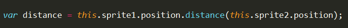
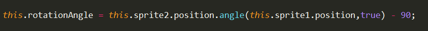
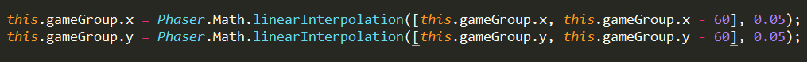
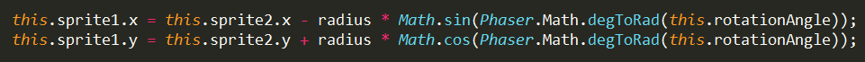

##2016.12.5 工作记录
**小技巧**学到了一些在查看phaser文档时不曾注意的属性和相应用法。
- **两个point object之间的距离** ：返回距离，类型number

- **两个point object之间的角度** ：返回角度，类型number

- **Phaser.Math.linearInterpolation**  ：返回插入的值，类型number

有两个参数，第一个为数组，第二个为斜率，线性插入，通常用于tween。这个算是拓展一下自己的思路吧。

 `小tip：`放在update函数中每帧刷新就可以让sprite1围绕sprite2旋转 

