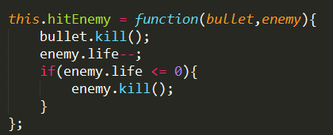
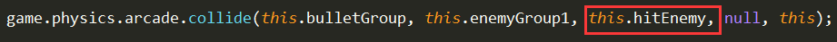

## 2016.12.6 工作记录
在写飞机大战的游戏大概框架，完成了飞机的显示，子弹的发射与回收，小型敌机的随机生成与回收。

**碰到的一些问题**
-  组内碰撞检测得到碰撞的两个对象，是回调函数的默认参数

- 碰撞检测的回调函数不带`（）`

**未解决的问题**
- 飞机不能拖动，没报错 无效果 待解决
``` python
this.plane.inputEnabled = true;
this.plane.input.enableDrag();
```
3.三种敌机代码逻辑相似，在想如何封装成一个函数放到模板里。