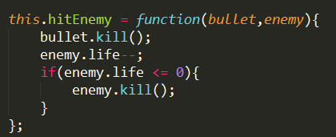

#201612工作记录
* 这是201612月的工作记录


 ##20161206星期二
 在写飞机大战的游戏大概框架，完成了飞机的显示，子弹的发射与回收，小型敌机的随机生成与回收。

**碰到的一些问题**
-  组内碰撞检测得到碰撞的两个对象，是回调函数的默认参数

- 碰撞检测的回调函数不带`（）`

**未解决的问题**
- 飞机不能拖动，没报错 无效果 待解决
``` python
this.plane.inputEnabled = true;
this.plane.input.enableDrag();
```
3.三种敌机代码逻辑相似，在想如何封装成一个函数放到模板里。

##20161207星期三
基本完成了飞机大战的游戏框架。

#####已解决的问题
- 看了永亮的说明，解决了缩放带来的飞机拖拽问题。
- `phaser.physics.arcade.collide`在检测碰撞的同时还会有一些碰撞的物理效果，相比之下`phaser.physics.arcase.overlap`只检测碰撞所以后者性能比较高。
- 
#####记录一些可能需要优化的地方
- 不同阶段的分数，敌机的产生速率不同，简单的用了：不同分数清除`game.events.loop`并产生新的`game.events.loop`.虽然效果是达到了，但感觉不够优雅。
``` javascript
this.checkScore = function(){
    if( score >= 30 && score < 130 ){
        game.time.events.remove(this.enemyLitileTimer1);
        this.enemyLitileTimer2 = game.time.events.loop(1000, this.generateEnemy1, this);
    } else if( score >= 130 && score < 300){
        game.time.events.remove(this.enemyLitileTimer2);
        this.enemyLitileTimer3 = game.time.events.loop(500, this.generateEnemy1, this);
        this.enemyMiddleTimer1 = game.time.events.loop(4000, this.generateEnemy2, this);
    }
};
```
-  随机生成敌机时位置发生重叠。用了一个临时变量`random`记录随机生成的位置，在下一次生成敌机时进行条件判断。
只能进行上下两次位置的判断，所以第一次生成的可能会与第n次的发生重叠。
``` javascript
{
    var random;
    var randomX = game.rnd.integerInRange(0, maxWidth);
    var randomY = game.cache.getImage('enemy1').height
    if(randomX != random && randomX != random + 200 && randomX != random - 200){
        enemy1.reset(randomX, -randomY);
        enemy1.body.velocity.y = 200;
        random = randomX;
    }
}

```