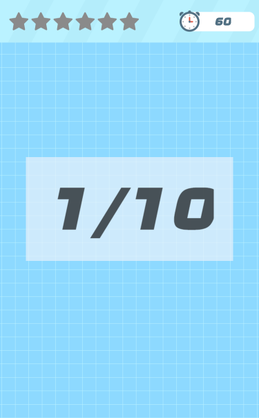
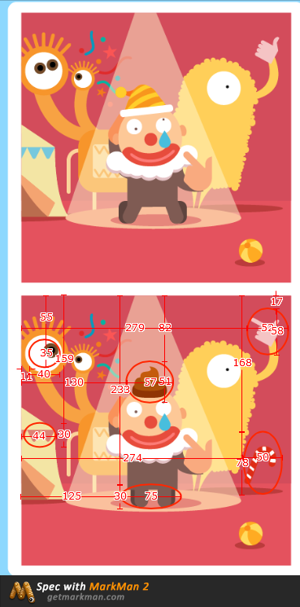
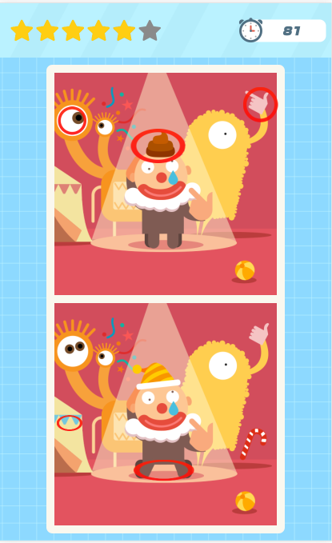

#201612月份工作记录
---
### 20161207星期三 ###
#### 今天的内容如下： ####
- 学习使用MarkDown的基本使用方法，并学会编写.md文件
- 接手找茬游戏开发项目，过了一遍项目的内容，大概掌握了开发思路，现在试着分解游戏，并寻找实现相关方法的对应函数等。
- 今天主要做了一些资源的加载，背景图的设置等。
- 明天
```javascript
{
	this.head = game.add.image(0,0,'head');
    this.head.width = game.world.width;
    var headMiddle = (this.head.height - 64) / 2;
    var figureX = (this.head.width - 220 - 13);
}
```
- 遇到的困惑：第一次接手项目，相当于一个全新的开始吧，所以遇到很多问题，感觉目前最大的问题用什么函数来实现游戏中的一些功能，因为phaser中有很多方法都相似，造成自己在选的时候纠结，目前尝试着通过查找文档来解决，希望早日加强phaser中各种方法

---
### 20161210星期六 ###
#### 今天的内容如下： ####
- 今天基本完成了游戏页面前的加载，六个星星的显示和替换，时钟的放置，字体的插入，关卡提示的渐变效果等。
- 修复了字体的插入bug还有就是星星之间的替换。
- 未完成：计时器未添加进去。
- 未解决的bug：字体显示的时候后面的那个字未全部显示出来。
```javascript
{
	this.stars = game.add.group();//把六个空心星星添加到头部
	    for(var i = 0; i < 6; i++) {
        this.stars.create((23 + i * 64), (this.head.height - 64) / 2, 'star1');
    }
    //html中的代码，插入score.otf字体
	@font-face {
		font-family: 'timeFont';
		src:url('assets/fonts/score.otf')format('opentype');
		font-weight: normal;
		font-style: normal;
	}
	setTimeout(function() {//插入opentype字体
        timeText = game.add.text(620, 45,'60');
        timeText.font = 'timeFont';
        timeText.fill = '#506F82';
    },1);
    
	//开始游戏之前，关卡提示显示一秒，一秒后消失
	this.levelText = game.add.text(game.world.centerX,game.world.centerY,level + '/' + allLevel);
	this.levelText.font = 'timeFont';
    this.levelText.fontSize = 144; 
    this.levelText.anchor.setTo(0.5,0.5);
    this.levelText.alpha = 1;
    var tween1 = game.add.tween(this.levelText).to({alpha:0},1000,null,true,1000,0,false);
}
```
#####完成工作截图如下：
 

---
### 20161211星期日 ###
#### 今天工作内容如下： ####
- 学习Console的一些调试技巧，断点调试之类的。
- 完成计时器功能的添加。
- 初学Html5 中利用canvas来画一个圆角矩形，再游戏中添加一个白色圆角矩形背景。
- 完成找茬小游戏中页面布局。
```javascript 
{
   //开启计时器
    this.startTime = function() {
        //开启计时器
        timer = game.time.create();
        timer.loop(1000,function() {
            countDown--;
            timeText.text = countDown;
        },this);
        timer.start();
    }

this.newWhiteBg = function() {
    //新建一个白色圆角矩形背景
    var bgWidth = game.world.width * 0.8;
    var bgHeight = game.world.height - this.head.height - 40;

    rectBitmap = game.add.bitmapData(bgWidth, bgHeight);
    rectBitmap.context.roundRect(0, 0, bgWidth, bgHeight, 15);
    rectBitmap.context.fillStyle = "#FAF8EF";
    rectBitmap.context.fill();

    var centerBg = game.add.image(game.world.centerX,game.world.centerY + this.head.height / 2,rectBitmap);
    centerBg.anchor.setTo(0.5,0.5);
}	
//画圆角边框（利用Html5 中的canvas）
    CanvasRenderingContext2D.prototype.roundRect = function(x, y, w, h, r) {
        this.beginPath();
        this.moveTo(x + r, y);
        this.arcTo(x + w, y, x + w, y + h, r);
        this.arcTo(x + w, y + h, x, y + h, r);
        this.arcTo(x, y + h, x, y, r);
        this.arcTo(x, y, x + w, y, r);
        this.closePath();
        return this;
    }; 
}
```

---
### 20161214星期三 ###
#### 今天工作内容如下： ####
- 完成了找茬游戏的晋级图片插入、晋级函数，通过函数等，剩下的就是游戏的逻辑，也就是游戏找茬部分。
- 学习了手机游戏的缩放效果。
```javascript
{
    //添加图片参数
    var puzzleOne;
    var puzzleTwo;
    //插入拼图和白色背景
    this.insertPuzzle = function() {                
        this.newWhiteBg();
        var puzzleValue1 = 'puzzle' + (2 * level - 1);
        var puzzleValue2 = 'puzzle' + 2 * level;
        puzzleOne = game.add.image(game.world.centerX,game.world.centerY ,puzzleValue1);
        puzzleOne.anchor.setTo(0.5,0.9);
        puzzleTwo = game.add.image(game.world.centerX,game.world.centerY + 70,puzzleValue2);
        puzzleTwo.anchor.setTo(0.5,0);
    }

	 //晋级函数
    this.nextLevel = function() {
        this.insertPuzzle();
        this.emptyStar();
        this.startTime();
    }

    //通关函数
    this.gameFinish = function() {
        timer.pause();
        timeText.text = 99;
        level++;
        puzzleOne.destroy();
        puzzleTwo.destroy();
        centerBg.destroy();//把之前的图片都删掉
        this.gameHint();//播放游戏关卡提示和开始动画
        game.time.events.add(6000,this.nextLevel,this);
    }

}
```

---
### 20161216星期六 ###
#### 今天工作内容如下 ####
- 调整了游戏的页面缩放，游戏在各种手机型号的适配。
- 寻找正确答案距离图片坐标的距离，即正确答案的范围。
- 浏览phaser文档和学习phaser中的实例，学习input和pointer的使用方法。
```javascript
{
	//添加顶部背景横条
    var head_top = game.cache.getImage('head');
    this.head = game.add.image(0,0,'head');
    if(head_top.width/head_top.height >= 750/123) {
        this.head.width = game.world.width;
        this.head.height = this.head.width/(head_top.width/head_top.height);
    } else {
        this.head.height = game.world.height/(750/123);
        this.head.width = game.world.width;
    }

	//获取不同型号设备图片的缩放比例
    this.puzzle = game.cache.getImage('puzzle1');
    this.puzzleScale = game.world.height / 1208;
    this.puzzle.width = this.puzzle.width * this.puzzleScale;
    this.puzzle.height = this.puzzle.height * this.puzzleScale;
}
```
- 使用MarkMan寻找正确答案范围截图如下：
 

---
### 20161217星期六 ###
#### 今天工作内容如下： ####
- 完成了第一张图的游戏逻辑，剩下的把其他几张图弄完就基本完成找茬游戏demo任务。
- 添加了完成通关时的弹出动画。
- 修复了字体后面被削的问题，通过在后面添加一个空格。
- 遇到的问题：游戏代码的优化问题，写的代码有点冗长。
```javascript
{
game.input.onTap.add(function (e) {//判断游戏的不同点
    if(e.x * 2 > puzzleOne.x + 8 * Scale && e.x * 2 < puzzleOne.x + 8 * Scale +  64 * Scale
        && e.y * 2 > puzzleOne.y + 76 * Scale && e.y * 2 < puzzleOne.y + 76 * Scale + 64 * Scale && !tag[0]) {
        var right1 = game.add.image(puzzleOne.x + 8 * Scale,puzzleOne.y + 76 * Scale,'right');
        right1.width = 64 * Scale;
        right1.height = 64 * Scale;
        tag[0] = true
        score++;
        this.solidStar();
    }
    if(e.x * 2 > puzzleOne.x + 5 * Scale && e.x * 2 < puzzleOne.x + 5 * Scale +  58 * Scale&& e.y * 2 > puzzleOne.y + 252 * Scale && e.y * 2 < puzzleOne.y + 252 * Scale + 36 * Scale && !tag[1]) {
        var right2 = game.add.image(puzzleOne.x + 5 * Scale,puzzleOne.y + 252 * Scale,'right');
        right2.width = 58 * Scale;
        right2.height = 36 * Scale;
        tag[1] = true
        score++;
        this.solidStar(); 
    }
    if(e.x * 2 > puzzleOne.x + 172 * Scale && e.x * 2 < puzzleOne.x + 172 * Scale +  122 * Scale&& e.y * 2 > puzzleOne.y + 126 * Scale && e.y * 2 < puzzleOne.y + 126 * Scale + 78 * Scale && !tag[2]) {
        var right3 = game.add.image(puzzleOne.x + 172 * Scale, puzzleOne.y + 126 * Scale,'right');
        right3.width = 122 * Scale;
        right3.height = 78 * Scale;
        tag[2] = true
        score++;
        this.solidStar(); 
    }
    if(e.x * 2 > puzzleOne.x + 178 * Scale && e.x * 2 < puzzleOne.x + 178 * Scale +  136 * Scale&& e.y * 2 > puzzleOne.y + 352 * Scale && e.y * 2 < puzzleOne.y + 352 * Scale + 48 * Scale && !tag[3]) {
        var right4 = game.add.image(puzzleOne.x + 178 * Scale,puzzleOne.y + 352 * Scale,'right');
        right4.width = 136 * Scale;
        right4.height = 48 * Scale;
        tag[3] = true
        score++;
        this.solidStar(); 
    }
    if(e.x * 2 > puzzleOne.x + 424 * Scale && e.x * 2 < puzzleOne.x + 424 * Scale +  78 * Scale&& e.y * 2 > puzzleOne.y + 32 * Scale && e.y * 2 < puzzleOne.y + 32 * Scale + 80 * Scale && !tag[4]) {
        var right5 = game.add.image(puzzleOne.x + 424 * Scale,puzzleOne.y + 32 * Scale,'right');
        right5.width = 78 * Scale;
        right5.height = 80 * Scale;
        tag[4] = true
        score++;
        this.solidStar(); 
    }
    if(e.x * 2 > puzzleOne.x + 410 * Scale && e.x * 2 < puzzleOne.x + 410 * Scale +  72 * Scale&& e.y * 2 > puzzleOne.y + 274 * Scale && e.y * 2 < puzzleOne.y + 274 * Scale + 92 * Scale && !tag[5]) {
        var right6 = game.add.image(puzzleOne.x + 410 * Scale,puzzleOne.y + 274 * Scale,'right');
        right6.width = 72 * Scale;
        right6.height = 92 * Scale;
        tag[5] = true
        score++;
        this.solidStar(); 
    }
},this);

	var testSprite = game.add.sprite(game.world.centerX,-200,'success');//通关动画
    testSprite.anchor.set(0.5);
    game.add.tween(testSprite).to({y:game.world.centerY},2000,Phaser.Easing.Bounce.Out,true);
}
```

- 完成工作截图：
- 

