#JS笔记
###初探JS
####1.获取元素
```javascript
document.getElementById(‘’)
```
####2.样式优先级
- ***<标签（DIV）<class<ID<行间**
####3.style操作（读、写）的都是在行间样式里

####4.Style与className
>不建议混合使用这两个，如统一使用style来修改属性
- 元素.style.属性 = xxx 是修改行间样式
- 之后再修改className不会有效果
####5.提取行间事件
- 行间不需要写onclick属性
- 在代码里面通过
```javascript
xx = document.getElementById(‘’)//获取元素
xx.onclick= 注册事件//可用匿名函数
```

####6.在页面加载完后才加载里面的代码
```javascript
window.onload = function(){}
```

####7.行为JS、样式CSS   、结构HTML三者分离

####8.获取一组元素
```javascript
document.getElementsByTagName('div')
```
> 数组的使用（数组长度：.length）
   取特定部分元素：当有一组具有相同标签的元素，想取其中一部分时，可在该部分定义

####9.选项卡的制作
-  点击其中一个按钮时，让所有按钮变为初始，再让这个按钮变高亮（标注为选中）
-  js：通过元素.index为每个按钮定义下标，并根据下标让相应的内容显示
-  input标签用value获取值，其他标签（如div）使用innerHTML，并可以赋值html元素

###JS基础
####1.变量类型
```javascript
number、string、boolean、undefined、object、function
```
>typeof  返回变量类型

####2.类型转换（强制类型转换）
- 字符串转整数数字parseInt（）  从左到右扫描字符串，碰到非数字的字符则返回
- parseFloat（）

####3.NaN
- Not a Number 非数字
- 任何数与NaN相加返回NaN
- NaN != NaN
- isNaN（） 判断是否NaN

####4.== 与 ===
- == 先（隐式）转换类型，然后比较：  5 == ‘5’ true
- - === 不转换类型，直接比较： 5 === ‘5’false

####5.闭包
- 子函数可以用父函数定义的变量

####6.命名规范
- 类型前缀（仅变量，函数不用）
- 首字母大写
- 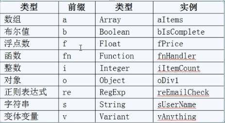

####7.真 假
- true：true、非零数字、非空字符串、非空对象
- false：false、数字零、空字符串、空对象（null）、undefined

#### 8.Json
- 定义：
```javascript
var json = {a：12，b：5，c：‘abc’};
```
- 访问：
```javascript
 json.a或json['a'] //数组通过数字下标访问
``` 

###深入JS
####1.函数
- 访问参数：数组arguments[]，用处：函数定义可以不传参数，使用函数时传参

####2.兼容处理
- 取样式：
```javascript
 if（oDiv.currentStyle{
	 oDiv.currentStyle[attr]
 }
else  {
	getComputedStyle（oDiv，False)[attr]
}
``` 

####3.样式
- 复合样式：background、border
- 单一样式：width

####4.数组
- 定义：
```javascript
 var arr = [1,2,3] 
 var arr = new Array（1,2,3）//作用一样
``` 
- 属性：length，可读可写。 如清空数组：length=0

- 添加、删除
  - push（e） 尾部添加
  - pop（e）  尾部删除
  - unshift（e）  头部添加
  - shift（e）  尾部删除
  - splice（起点，长度，元素）删除元素，并在起点插入元素
        - splice（2,3） 删除
        - splice（2，0，‘a’，‘b’，‘c’）插入
        - splice（2,2，‘a’，‘b’）替换
 - concat（数组2） 连接两个数组   
 -  join（‘’） 连接元素，返回字符串
 -  排序
   -sort() 默认根据字符串来排序
   -arr.sort（function(n1，n2){   return n1 - n2；}）；

###定时器制作
####1.timer = setInterval（函数，间隔）无限执行
####2.timer =setTimeOut（函数，时间）执行一次   例子：延时提示框
####3.clearInterval（timer）/ clearTimeOut（timer）关闭指定定时器
####4.获取系统时间
```javascript
   -var oDate = new Date（）；
   -oDate.getSecond() //获取秒  ...
``` 
####5.获取字符串某一位
   -str[]
   -str.charAt() 兼容许多浏览器
####6.无缝滚动
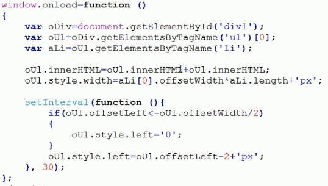

###DOM基础
####1.DOM节点
- childNodes 获取子节点（一些浏览器不兼容） 
- nodeType（oU1.childNodes[i].nodeType）
 - nodeType == 3   =>   文本节点
 - nodeType == 1    =>    元素节点
- children 获取子节点（常用，返回数组）
- firstChild（有兼容问题）、firstElementChild（不存在则判断为false）
- lastChild、lastElementChild
- parentNode获取父节点 		例子：点击链接，隐藏整个li
- offsetParent 		例子：获取元素在页面上的实际位置

####2.元素属性操作
```javascript
//属性操作
 style.属性名
 style[属性名]    修改不确定的属性使用
 setAttribute(属性名，值)
 
   getAttribute（名称）
   removeAttribute（名称）
``` 
#### 3.用className选择元素（批量化/选择性获取元素）
 - if(xx.className == ‘’)
 - 获取指定className的元素集
 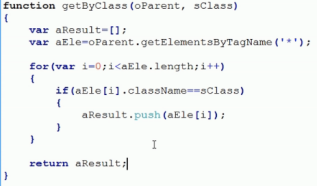

###DOM操作应用
####1.创建DOM元素
```javascript
var oLi = document.createElement//（标签名）
oUl.appendChild(oLi)//先把元素从原有的父集上删掉，再添加到oUl末尾中
oUl.insertBefore（oLi，某个元素） //添加到oUl的某个元素之前
``` 
####2.删除DOM元素
- removeChild（子节点）

####3.文档碎片（在低级浏览器，可以提高性能）
- createDocumentFragment（）

###DOM操作应用高级（表格）
####1.获取
 - tBodies    、  tHead、       tFoot、         rows、      cells
####2.模糊搜索
 - str1.search（str2  找到并返回str2在str1的位置，没有找到返回-1
####3.不区分大小写
  - str.toLowerCase（）
####4.多关键词搜索
 - arr = str.split（‘’）  字符串切开成数组
####5.排序过程
 - 定义新数组arr
 - 将document.getElementsByTagName获得的数组tags赋给新数组
 - 新数组arr对每个元素的innerHTML值进行排序
 - 数组tags使用appendChild来插入数据

###JS事件基础
####1.event对象
 - 用来获取事件的详细信息：鼠标位置、键盘按键
 > -例子：获取鼠标位置：event.clientX，event.clientY（可视区坐标）
 
 - 解决获取event对象的兼容性问题：oEvent = event||ev；
 -  document的本质：
```javascript
 document.childNodes[0].tagName;
```

####2.事件流
 - 事件冒泡（触发onclick事件后，会一层一层的往上传）
 - 取消冒泡：event.cancelBubble = true；

 
####3.获取鼠标在页面的绝对位置
 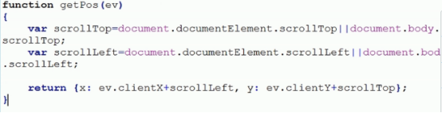

####4.事件绑定
- attachEvent（事件名， 函数）  可以绑定多个函数  ——事件名‘click’，IE起作用
    - detachvent（事件名， 函数）   解除绑定
- addEventListener（事件名， 函数， false） ——事件名‘onclick’，FF、chrome
      - removeEventListener（事件名， 函数， false）解除绑定

###Ajax基础
####1.HTTP请求方法
 - GET  用于获取数据（如浏览帖子）
   - 通过网址传递
   - 容量小
   - 安全性差
   - 有缓存
 - POST 用于上传数据（如用户注册）
   - 不通过网址
   - 容量大（2G）
   - 安全性较好
   - 无缓存
  
####2.Ajax四个步骤
 - 创建Ajax对象
```javascript
var oAjax = new XMLHttpRequest（） //兼容非IE6me;
```
 - 连接到服务器
```javascript
oAjax.open（方法， 文件名， 异步传输）oAjax.open（‘GET’，‘a.txt’，true）
   //-同步：事情一件件来
   //-异步： 多个事情可以一起做
```
 - 发送请求
 -  接收返回
```javascript
oAjax.onreadystatechange = function() {
}
```

###JS面向对象基础
####1.对象的组成
 - 方法 ：过程、动态的
 - 属性 ：状态、静态的
 - 注：不在系统对象随意添加方法、属性，否则会覆盖已有方法、属性

####2.this ：当前方法属于的对象

####3.构造函数的定义
 - 构造函数内系统默认做两件事
```javascript
 var this = new Object（）;
 return this;
```

####4.原型prototype
 - 类似CSS中的class（一次给一组元素加样式）
 - 共享同一方法或属性
 - 实际应用：用构造函数加属性，用原型加方法 ——混合方式构造对象

####5.call方法可以改变函数执行时的this

####6.继承
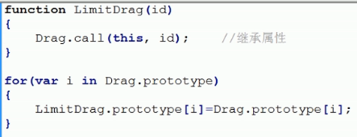


###BOM应用
####1.打开窗口
```javascript
window.open(jumpTo) 
```
  - 第一个参数为跳转的页面
  - 第二个参数为是否新建（‘_blank’为新建，‘_self’为覆盖当前页面）

####2.关闭窗口
```javascript
window.close()
```
  - 火狐浏览器不能关闭用户打开的界面

####3.写窗口
```javascript
document.write(‘’)
```
  - 先清空再写


####4.浏览器版本、类型
```javascript
window.navigator.userAgent
```

####5.尺寸
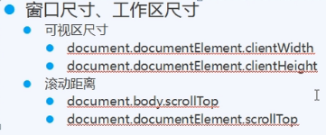
> 两个获取滚动距离的方法可以用||并起来，解决兼容问题

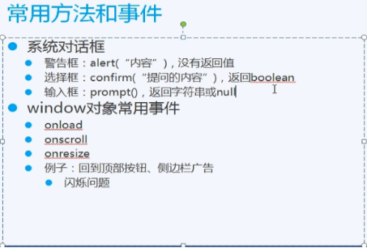


###COOKIE基础与应用

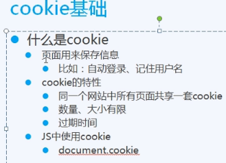
> cookie赋值不会覆盖，相当于+=

####1.设置过期时间
```javascript
 var oDate = new Date();
   oDate.setDate(oDate.getDate() + 14);
   document.cookie = ‘user = blue;expires=’ + oDate;
   //函数封装
   function setCookie(name, value, iDay){
	  var oDate=new Date();
	  oDate.setDate(oDate.getDate()+iDay);
	  document.cookie=name+'='+value+';expires='+oDate;
   }
```

####2.读取cookie
```javascript
  //函数封装
  function getCookie(name)
{
	var arr=document.cookie.split('; ');
	
	for(var i=0;i<arr.length;i++)
	{
		var arr2=arr[i].split('=');
		
		if(arr2[0]==name)
		{
			return arr2[1];
		}
	}
	
	return '';
}
```

####3.删除cookie
```javascript
  //函数封装
  function removeCookie(name)
{
	setCookie(name, 1, -1); //参数name、value、expireDay
}
```


###正则表达式
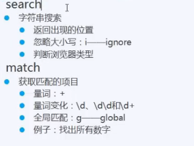
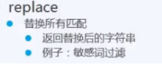
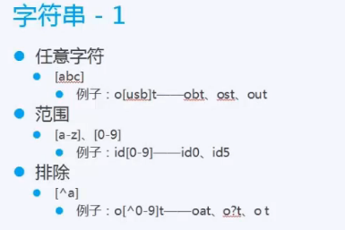
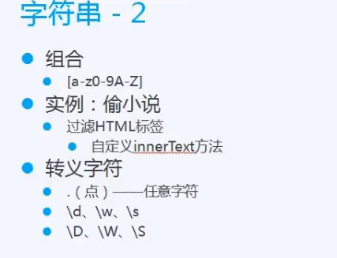
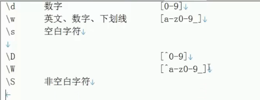
> 转义字符.尽量少用，可以考虑用排除[^]某种特殊情况代替.
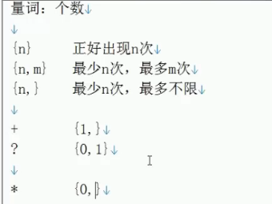
- 例子：检验邮箱
```javascript
var re = /\w+@[a-z0-9]+\.[a-z]+/i
//      \w+  @ [a-z0-9]+  \. [a-z]+ /i
re.test(oTxt.value)	//
若字符串一部分符合，返回true
```
-  ^  行首
- $  行尾


