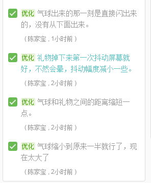

#2016年12月工作记录

##2016年12月05日周一

###今天做了：
- **学习并使用Markdown**

- **Phaser开启物理引擎** 
```javascript
    game.physics.enable(object, children);//给单个object对象开启，object可以传入数组[o1，o2，...，on]开启o1到on的物理系统
	group.enableBody = true; group.physicsBodyType = Phaser.Physics.ARCADE;//给组里每个对象开启（不包括子对象）
```
- **进一步学习了解js面向对象编程，了解DOM操作**
####Phaser.Example学习和总结：
- **获取上下左右按键**
```javascript
	var cursors = game.input.keyboard.createCursorKeys();
	//cursors.up/down/left/right
	
	/****获取其他按键****/
	var fireButton = game.input.keyboard.addKey(Phaser.Keyboard.SPACEBAR);
	//fireButton.isDown
```
- 区分collide和overlap，使用collide，两个对象会发生碰撞，而使用overlap，弹珠会穿过物体，因为overlap只是返回重叠结果


- [深入详解Phaser补间动画](http://www.grycheng.com/?p=1748) 其中缓动参数ease可在里面找


###修复了：
- **解决PlaneGame敌机爆炸没有销毁的问题**
由于敌机添加和播放动画的代码不在一起，无法直接在添加动画时获取动画，此时可以用
```javascript
    var expanim = explosion.animations.getAnimation(config.explodePic);
    
```
来获取动画，并在动画播放完时销毁敌机。
- **重新开始游戏时注意要将game.paused 设置为 false**


####计划:
- 在网上找了几个phaser游戏例子，接下来阅读代码并去实现，提升自己对phaser游戏开发的熟练度
- 完成强子布置的任务 看完智能社的Javascript视频教程，并写总结。


-------
##2016年12月12日周一
* 看完了智能社的js视频，并完成总结
* 收到新分配的任务，学习手势识别
* 找到手势识别资料并学习去使用
> [ElemeFE/smart-gesture](https://github.com/ElemeFE/smart-gesture)


* 发现问题
* 在上面网址给的demo上，只有smart-gesture.min.js，应该是主要的手势识别库，下次工作重点学习如何调用他


-------
##2016年12月14日周三
* 安装Tortoise svn
> magictouch游戏开发

* 分析手势识别库并实现
  * **将手势识别功能引用到公司样例上**
  * **增加任意新的手势**
* 实现背景变红需求
```javascript
this.bg.tint = 0xe26c6c;//礼物即将到达边界时，背景需要变红
```
* 实现屏幕震动
```javascript
this.shake = function() {
	 game.camera.shake(0.05, 500);
	 //强度和持续时间
}
```

###**发现问题**

* *svm*手势轨迹没有显示。
 * 原因：canvas不是像div这样的标签，一般都是不可以内嵌标签在里面的
 * 解决方案：将*svm*直接在*body*里生成

##2016年12月18日周一
* 配置github缓存
>好处:加快内网环境下clone、pull、push的速度
>触发测试环境的代码同步，保持测试地址的代码是最新的。

* 添加需求的所有手势

###**发现问题**
* magictouch在电脑上运行的没问题，且没报错，但在手机上运行却黑屏
**解决方法** 引入js.console库，并在手机端查找报错。
**报错代码**
```javascript
onSwipe: (list) => {
     console.log(list);
},

onGesture: (res, points) => {                            console.log(res);
this.res = res;
lastPoints = points;
}
```
**报错原因** 手机不支持es 6语法
**解决方法** 不适用es 6语法，改为普通函数定义
```javascript
onSwipe : function(list){
console.log(list);
},
 onGesture : function(res,points){
self.res = res;
lastPoints = points;
                            console.log(self.res);
 }
```
> 在函数定义里面，this是指向该函数对象，因此this.res = res;需改为self.res = res;


##2016年12月21日周三
* **magictouch完成部分**
 * 完成手势图对应的气球炸裂
 * 完成气球炸裂后，隔壁气球相应的移动
 * 完成气球与礼物间的连线，且连线会根据气球的移动而移动，但仅仅是线，样子过于简单，可能需要改用其他方法
 * 完成礼物所绑定的所有气球炸裂后，礼物要掉下去

###**发现问题**
* **3个气球的情况，左（或右）气球炸裂后，右（或左）气球会向中间移动，覆盖住中间的气球，写了检测碰撞的函数，但没有效，有时却不会。而中间气球炸裂，左右两个气球正常向中间靠拢，碰撞后则停止。**
```javascript
this.balloonsCollide = function(balloonArray) {
	for (var i = 0; i < balloonArray.length; i++) {
		balloonArray[i].line.fromSprite(balloonArray[i].gift, balloonArray[i], false);
		var giftX = balloonArray[i].gift.x;

		if (Math.abs(balloonArray[i].x - giftX) <= 1 && balloonArray[i].body.velocity.x != 0) { //当气球的x坐标与礼物相等时且速度不为0，则停止
			balloonArray[i].body.velocity.x = 0;
			console.log("该停止啦");
        }

       if (balloonArray[i + 1] != null) {
           game.physics.arcade.collide(balloonArray[i], balloonArray[i + 1], function() {
                balloonArray[i].body.velocity.x = 0;
                balloonArray[i + 1].body.velocity.x = 0;
                console.log("碰撞");
                }, null, this);

       }

      }
  
}
```
**解决方法** 尚未解决

* **绳子用划线替代，但显示不出来**
**解决方法** 在render中写
```javascript
this.render = function(){
       for(var i = 0; i <this.balloonArray.length; i++){                        
           game.debug.geom(this.balloonArray[i].line, '#140a16', false );
        }                    
}

//在外面添加
game.state.add('render',game.States.play.render);
```

* 绳子（划线）如何添加图片，让效果更好看
**解决方法** 尚未解决


##2016年12月22日周四
* **magictouch完成部分**
 * 完成美工资源的加载
 * 完成礼物下降的效果
 * 修改了气球炸裂后，旁边气球移动的问题。**解决方法** 将参数改为数组传入
```javascript
	game.physics.arcade.collide(balloonArray[i], balloonArray, function() {
      balloonArray[i].body.velocity.x = 0;
}, null, this);
```


###**发现问题**
* 碰撞函数，条件不满足时也触发
**解决方法** 传入的函数参数不能带括号，否则视为直接调用函数

* 在iPhone5下，生成气球会出界外
**解决方法** 尚未解决


##2016年12月23日周无
* **magictouch完成部分**
 * 完成礼物掉下后，有+1分数出现
 * 完成计分系统
 * 完成tower上的需求优化
 

###**发现问题**
* 开启了物理系统，以及礼物弹性，并且开启了边界检测，但实现不了礼物碰撞边界后反弹的效果，礼物直接跑去界外
**解决方法** 尚未解决 


**有待优化的部分**
* 画手势后恐龙有时候会瞬移
* 礼物掉地上实现翻滚效果
 
