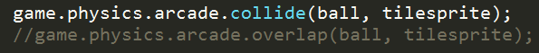
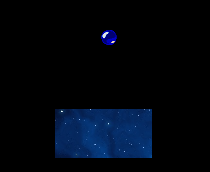

#2016年12月工作记录

##2016年12月05日周一

###今天做了：
- **学习并使用Markdown**

- **Phaser开启物理引擎** 
```javascript
    game.physics.enable(object, children);//给单个object对象开启，object可以传入数组[o1，o2，...，on]开启o1到on的物理系统
	group.enableBody = true; group.physicsBodyType = Phaser.Physics.ARCADE;//给组里每个对象开启（不包括子对象）
```
- **进一步学习了解js面向对象编程，了解DOM操作**
####Phaser.Example学习和总结：
- **获取上下左右按键**
```javascript
	var cursors = game.input.keyboard.createCursorKeys();
	//cursors.up/down/left/right
	
	/****获取其他按键****/
	var fireButton = game.input.keyboard.addKey(Phaser.Keyboard.SPACEBAR);
	//fireButton.isDown
```
- 区分collide和overlap，使用collide，两个对象会发生碰撞，而使用overlap，弹珠会穿过物体，因为overlap只是返回重叠结果



- [深入详解Phaser补间动画](http://www.grycheng.com/?p=1748) 其中缓动参数ease可在里面找


###修复了：
- **解决PlaneGame敌机爆炸没有销毁的问题**
由于敌机添加和播放动画的代码不在一起，无法直接在添加动画时获取动画，此时可以用
```javascript
    var expanim = explosion.animations.getAnimation(config.explodePic);
    
```
来获取动画，并在动画播放完时销毁敌机。
- **重新开始游戏时注意要将game.paused 设置为 false**


####计划:
- 在网上找了几个phaser游戏例子，接下来阅读代码并去实现，提升自己对phaser游戏开发的熟练度
- 完成强子布置的任务 看完智能社的Javascript视频教程，并写总结。


