# 基础 #
###获取控件
	getElementByID //每次取一个元素
	getElementsByTagName //每次取一组元素，每次只能对一个元素进行操作


###匈牙利命名法 类型前缀+首字母大写
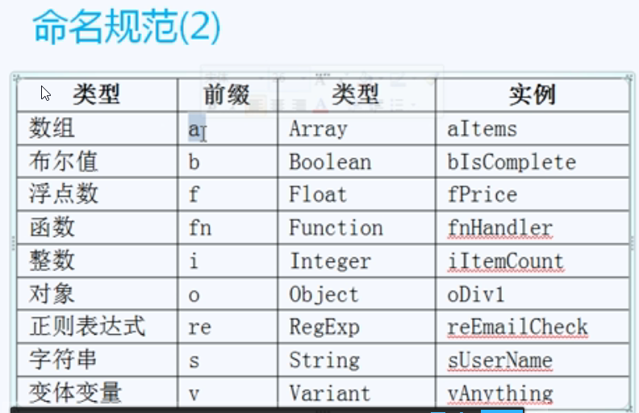

###JSON
- JSON的下标是字符串、数组的下标是数字
- JSON没有length（JSON有什么才能读什么）
- 循环的另一个写法：for（var i in 数组）——JSON的循环用这个方法写

###一些基础函数
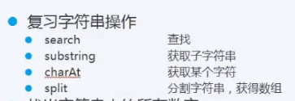
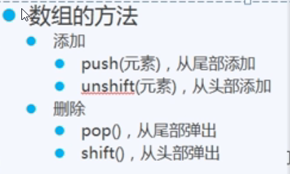
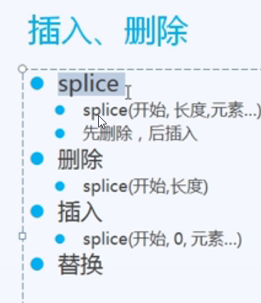
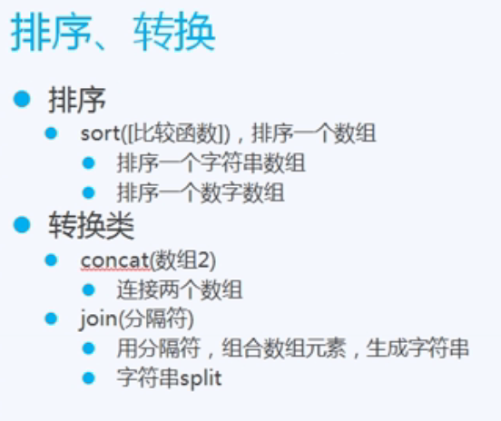
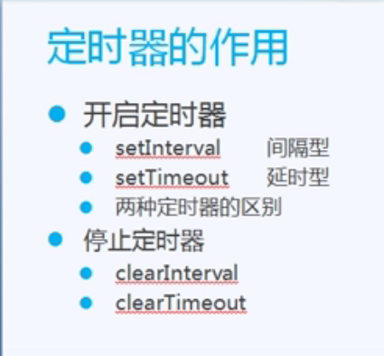

###基础
- 在head加载script最好这样定义函数
```javascript
	window.onload = function(){} //不然js可能会无法获取对象
```

- 任何数和NAN作运算结果都是NAN
- NAN和NAN不相等，可以用isNAN判断
- == 先转类型，再比较；=== 不转类型，直接比较


- 函数不定参数，就是传入arguments[i]，可以有无数个参数

- css(oDiv, ‘backGround’,’green’)设置背景颜色
- css(oDiv, ‘backGround’）获取背景颜色

- 通过if（xxx） else（xxx）来解决兼容问题

# DOM： #
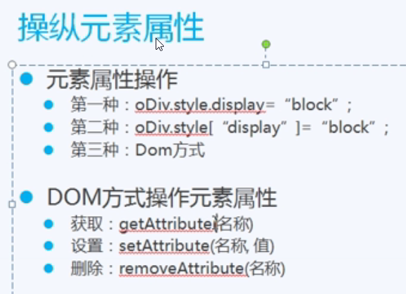

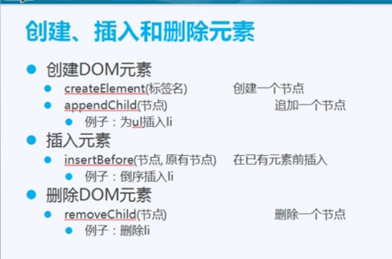
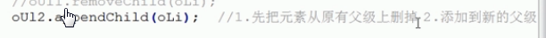

###在同一个父级上用这方法，会把元素查到表格最后，可以用来排序
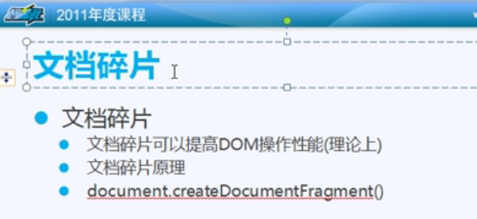（并没有什么用）

###表格
	  getElementsByName(‘Body’)[o]  可以用 Bodyies代替；
      获取行用 rows[i]  ，行中元素用cells[i]。

###搜索
	1.在字符串中定位字符用 search（），若找不到，返回-1（可以用这个做模糊搜索，若xxx.seach(‘tt’）!== -1  )

	2.var arr = sTxt.split(‘ ‘) ：把xTxt中空格隔开的字符串切开，放在arr的数组中（可做多重搜索）

###排序
	把该元素组合赋值给一个数组，数组进行排序，再根据数组的顺序appendChild
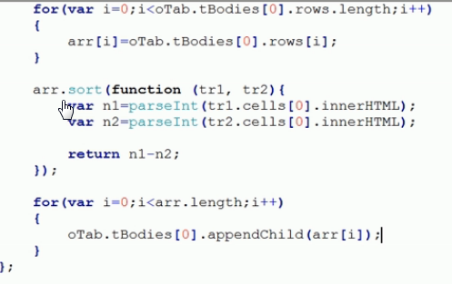

# 运动 #

	Math.floor()向下取整  
	Math.ceil()向上取整
	Math.abs() 绝对值
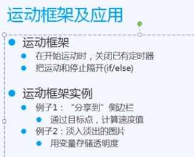
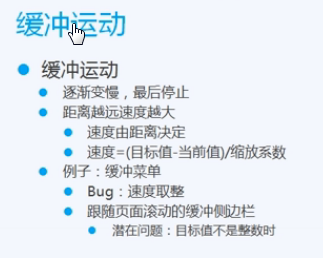


# 事件 #
###event对象
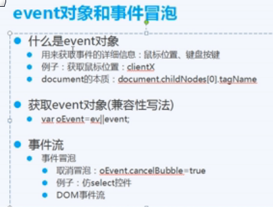

###取消冒泡
- 防止点击事件向父级传递

- 阻止右键默认菜单： 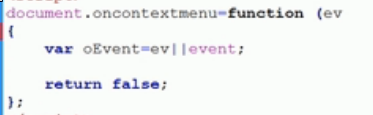

- 可以通过return false阻止默认行为
###事件绑定
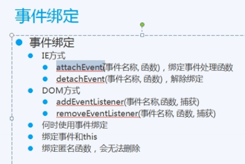

	addEventListener的事件名称不带on，比如只是click，不是onclick
	attachEvent的事件名称带on
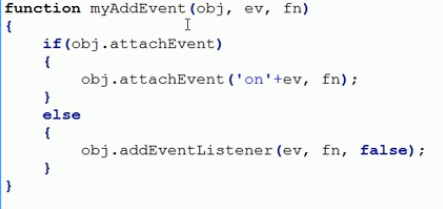

# Ajax #
###Ajax封装函数
```JavaScript
function ajax(url, fnSucc, fnFaild) //url:服务器文件路径，FnSucc：成功时执行的函数；fnFaild：失败时执行的函数
{
	//1.创建Ajax对象
	if(window.XMLHttpRequest)
	{
		var oAjax=new XMLHttpRequest();
	}
	else
	{
		var oAjax=new ActiveXObject("Microsoft.XMLHTTP");
	}
	
	//2.连接服务器（打开和服务器的连接）
//open(方法, 文件名, 异步传输)
	oAjax.open('GET', url, true);	
	
	//3.发送请求
	oAjax.send();
	
	//4.接收返回
	oAjax.onreadystatechange=function ()
	{
//oAjax.readyState	//浏览器和服务器，进行到哪一步了
		if(oAjax.readyState==4)	//读取完成
		{
			if(oAjax.status==200)	//成功
			{
				//alert('成功了：'+oAjax.responseText);
				fnSucc(oAjax.responseText);
			}
			else
			{
				//alert('失败了');
				if(fnFaild)
				{
					fnFaild();
				}
			}
		}
	};
}
```

###oAjax.readyState
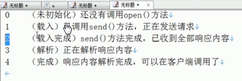

###缓存
- 一个url保存一遍
- 某些浏览器缓存一直长时间不变，如ie
- 对信息更改要求高的，要避免长期显示缓存内容

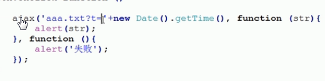

- 改url的GET属性（对后台没影响），不断请求服务器，不受缓存干扰
- eval（） 把文本读进一个js能解释的数组

###HTTP请求方法
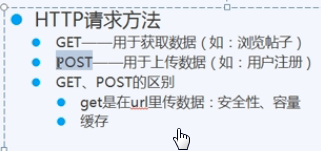
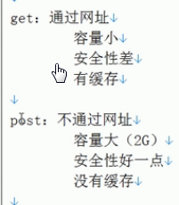

	AJAX使用异步操作

# 面向对象 #
	全局方法属于window之下
###this
	当前的方法属于谁，this就是谁
###原型

	原型对于js：相当于class对于css
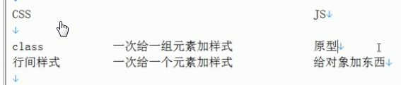
###普通对象
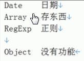

###流行的面相对象编程方式
	构造函数里面加属性、原型里面加方法
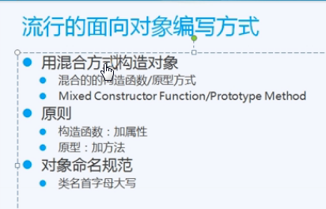

###继承
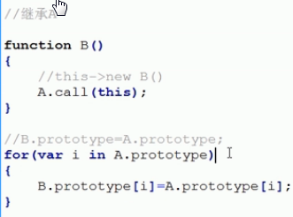
- 属性继承通过call实现，原型继承通过for循环

###其他
- call（）可以改变this 
```JavaScript
var arr1=[1,3,2]
arr2 =arr1  //arr2是arr1的引用
```

# BOM #
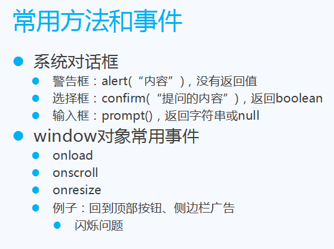
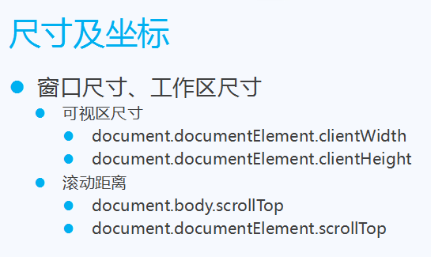


# COOKIE #

###Cookie基础
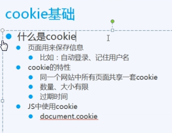
- 同一个网站，就是同一个域名
###封装cookie函数
```JavaScript
function setCookie(name, value, iDay)
{
	var oDate=new Date();
	oDate.setDate(oDate.getDate()+iDay);
	
	document.cookie=name+'='+value+';expires='+oDate;
}

function getCookie(name)
{
	var arr=document.cookie.split('; ');
	
	for(var i=0;i<arr.length;i++)
	{
		var arr2=arr[i].split('=');
		
		if(arr2[0]==name)
		{
			return arr2[1];
		}
	}
	
	return '';
}

function removeCookie(name)
{
	setCookie(name, 1, -1);
}

```
###使用cookie
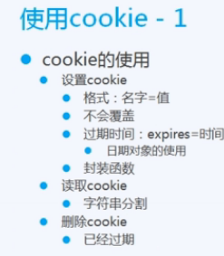


# 正则表达式	 #
###字符串与正则配合
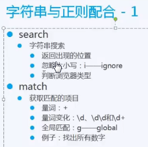
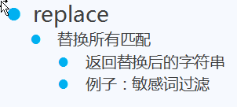

###正则表达式规则
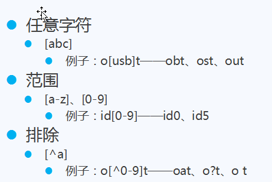
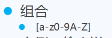
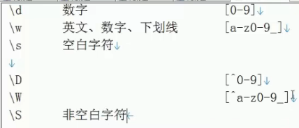

	re.test(oTxt.value)	若字符串一部分符合，返回true
	^: 行首
	$: 行尾

###量词
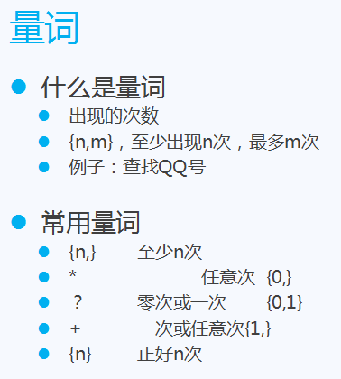
 *最好不要用